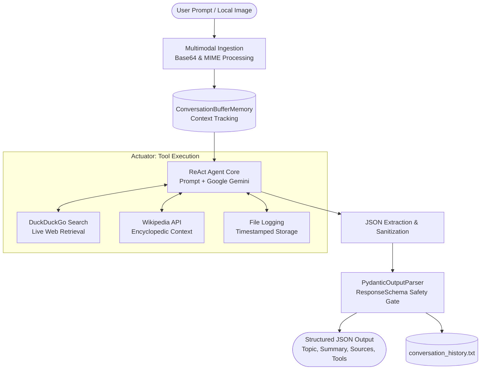

# Intelligent Multimodal Planning & Research Agent 🤖

[](https://www.python.org/)
[](https://www.langchain.com/)
[](https://ai.google.dev/)
[](https://github.com/NeelJani1/CS_767_Assignment/actions/workflows/ci.yml)
[](LICENSE)

> **Course:** CS 767 – Intelligent Software Agents  
> **Author:** Neel Jani (njan320@aucklanduni.ac.nz)  
> **Goal:** Design and implement an autonomous software agent prototype capable of multimodal perception, deliberative reasoning, and safe goal-directed tool execution.

---

## 🎥 Demo Video

[](https://drive.google.com/file/d/1HFRvBOcnLBepkx14RdPtprNDDann1R-7/view?usp=drive_link)

---

## 🧠 System Architecture

The agent is constructed on the **ReAct (Reasoning + Acting)** paradigm. It takes high-level user goals, formulates iterative reasoning steps, invokes specialized external tools, and verifies answers through strict Pydantic JSON schema constraints.



### Core Capabilities

| Capability | Module | Description |
| :--- | :--- | :--- |
| **Perceive** | `HumanMessage` + Base64 | Accepts multimodal inputs (conversational text + local image files in JPEG, PNG, WEBP) to visually ground research. |
| **Decide** | `ChatGoogleGenerativeAI` | Autonomous ReAct reasoning loop powered by Gemini Flash with deterministic configuration (`temperature=0.0`). |
| **Act** | `tools.py` | Live web research (`DuckDuckGoSearchRun`), encyclopedic lookups (`WikipediaQueryRun`), and file persistence. |
| **Memory** | `ConversationBufferMemory` | Multi-turn conversational memory, enabling follow-up adjustments without losing session context. |
| **Safety Gate** | `ResponseSchema` (`Pydantic`) | Enforces strictly validated JSON output (`topic`, `summary`, `source`, `tools_used`) to eliminate prompt hallucinations. |

---

## 📂 Project Structure

```
CS_767_Assignment/
├── .github/
│   └── workflows/
│       └── ci.yml               # Automated GitHub Actions CI workflow
├── tests/
│   ├── __init__.py
│   ├── test_agent.py            # Unit tests for image encoding & agent utilities
│   ├── test_schema.py           # Unit tests for Pydantic schema & JSON sanitization
│   └── test_tools.py            # Unit tests for search, wiki, and log persistence
├── .env.example                 # Environment configuration template
├── .gitignore                   # Comprehensive Python & environment ignores
├── conversation_history.txt     # Persistent conversation & research itinerary log
├── images.jpg                   # Sample image for multimodal vision testing
├── LICENSE                      # MIT Open Source License
├── main.py                      # Agent entrypoint and interactive terminal CLI
├── pyproject.toml               # Modern packaging metadata & tool configurations
├── readme.md                    # Comprehensive documentation & assignment report
├── requirements-dev.txt         # Development & testing dependencies
├── requirements.txt             # Core production dependencies
└── tools.py                     # Tool definitions & safe execution wrappers
```

---

## ⚙️ Reproduction Instructions

### 1. Prerequisites
- **Python 3.10+** (Tested on Python 3.10, 3.11, 3.12, 3.13)
- **Google Gemini API Key** (Free tier available at [Google AI Studio](https://aistudio.google.com/))

### 2. Clone and Setup Environment

```bash
# Clone the repository
git clone https://github.com/NeelJani1/CS_767_Assignment.git
cd CS_767_Assignment

# Create and activate a virtual environment
python -m venv .venv

# On Windows (PowerShell):
.\.venv\Scripts\Activate.ps1

# On macOS / Linux:
source .venv/bin/activate
```

### 3. Install Dependencies

```bash
# Install runtime dependencies
pip install -r requirements.txt

# (Optional) Install development & testing tools
pip install -r requirements-dev.txt
```

### 4. Configure API Keys

Copy the sample environment file and provide your Gemini API key:

```bash
cp .env.example .env
```

Open `.env` in an editor and insert your key:

```env
GOOGLE_API_KEY="your_actual_gemini_api_key_here"
GEMINI_MODEL="gemini-1.5-flash"
```

### 5. Running the Agent

Start the interactive session:

```bash
python main.py
```

- **Text queries:** Type your research or travel planning goal and press Enter.
- **Multimodal queries:** When prompted, provide the path to a local image (e.g., `images.jpg` or drag-and-drop into terminal).
- **Exit:** Type `exit`, `quit`, or press `Ctrl+C`.

---

## 🧪 Testing & Quality Assurance

This repository includes a comprehensive unit test suite covering tool error handling, image encoding, and JSON schema sanitization:

```bash
# Run test suite
pytest -v

# Run code style & lint checks
ruff check .
```

---

## 🔄 Design Evolution & Commit Checkpoints

As required by the CS 767 assignment, the system architecture evolved across distinct developmental checkpoints:

- **Checkpoint 1: Initial ReAct Setup with Gemini & Tools**
  - *Design:* Established the foundational ReAct loop utilizing `ChatGoogleGenerativeAI` with DuckDuckGo and Wikipedia tools.
  - *Challenge & Refinement:* Standard generative outputs produced unstructured text that could not be reliably integrated into automated file saving.

- **Checkpoint 2: Pydantic Output Parser as a Safety Mechanism**
  - *Design:* Introduced a strict `ResponseSchema` model with `PydanticOutputParser` and deterministic sampling (`temperature=0.0`).
  - *Challenge & Refinement:* Handled streaming list chunks and markdown delimiter edge cases by implementing custom output stitching and sanitization.

- **Checkpoint 3: Multi-turn Context Awareness via Conversation Memory**
  - *Design:* Integrated LangChain's `ConversationBufferMemory` inside an interactive REPL loop.
  - *Benefit:* Users can refine generated plans iteratively (e.g., modifying a 2-day itinerary into a 7-day trip) without restating context.

- **Checkpoint 4: Multimodal Vision Capabilities**
  - *Design:* Added local image ingestion via Base64 encoding and dynamic MIME detection.
  - *Challenge:* LangChain's standard memory buffer threw validation errors when passed raw image dictionaries.

- **Checkpoint 5: Architectural Memory/Vision Routing & Polish**
  - *Design:* Separated the chat history memory stream from a direct multimodal injection channel (`image_input` message placeholder), preserving conversational state while allowing image perception.

---

## 📄 License

This project is licensed under the [MIT License](LICENSE).
